# Fresadora CNC

* [Introdução à usinagem com router CNC](#introdução-à-usinagem-com-router-cnc)
* [Especificações da "Jennifer"](#especificações-da-jennifer)
* [Criação de percursos utilizando software CAM](#criação-de-percursos-utilizando-software-cam)
	* [Criação de percursos com ArtCam](#criação-de-percursos-com-artcam)
* [Normas de segurança](#normas-de-segurança)
* [Dicas de uso e manutenção da máquina](#dicas-de-uso-e-manutenção-da-máquina)
	* [Antes de iniciar os trabalhos](#antes-de-iniciar-os-trabalhos)
	* [Durante os trabalhos](#durante-os-trabalhos)
	* [Ao terminar os trabalhos](#ao-terminar-os-trabalhos)
	* [Periodicamente](#periodicamente)
* [Configuração e controle da máquina](#configuração-e-controle-da-máquina)
	* [Configuração do projeto no Mach3](#configuração-do-projeto-no-mach3)
	* [Funcionalidades úteis do Mach3](#funcionalidades-úteis-do-mach3)
* [Controlando a rotação](#controlando-a-rotação)
* [Referências](#referências)

## Introdução à usinagem com router CNC

Para uma boa introdução sobre fresadoras CNC, leia [GUIA: Entendendo a fresadora CNC – Brasília Fab Lab – Medium](https://medium.com/bsbfablab/guia-entendendo-a-fresadora-cnc-583fa153ef98).

## Especificações da "Jennifer"

Nossa fresadora, carinhosamente chamada de Jennifer, possui as seguintes especificações:

* **Materiais aceitáveis:** madeiras, acrílicos e metais leves (não ferrosos).
* **Dimensões da mesa:** 1100 (X) x 1100 (Y) x ~50 (Z) mm.

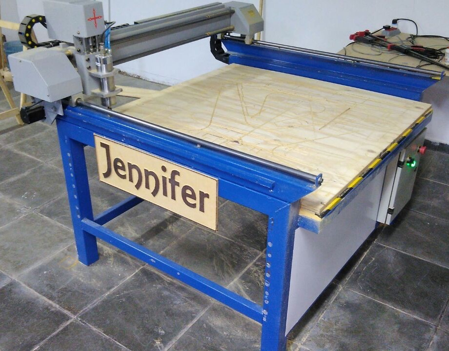

## Criação de percursos utilizando software CAM

Como mencionado anteriormente, precisamos utilizar um software CAM para transformar nosso projeto em um conjunto de instruções em G-code com os percursos de usinagem.

Nessa seção iremos abordar algumas funcionalidades simples do ArtCAM, focando em apenas 3 tipos de operações: perfilagem, desbaste e perfuração. O software possui muitas outras funcionalidades, mas você conseguirá executar a grande maioria dos projetos com apenas essas 3 operações.

### Criação de percursos com ArtCam

1. Para começar, abra o ArtCAM e clique em “Criar Novo Modelo” para abrir as configurações de um novo modelo.
	* 1.1. Opcionalmente clique em “Abrir Modelo Existente” para carregar um modelo já pronto.
2. Certifique-se que as unidades utilizadas estão definidas como “mm”.
3. Insira a altura do projeto, em milímetros, no campo indicado. Normalmente iremos utilizar altura e largura igual a 1000mm, que é o tamanho da mesa de trabalho. Para projetos menores, podemos utilizar valores menores, obviamente.
4. Insira a largura do projeto, em milímetros, no campo indicado.
5. Clique em “OK” para criar o projeto.

6. Para criar os percursos, clipe na aba “Percursos”.
7. Seu modelo novo/existente será mostrado na área em destaque.
	* 7.1. Selecione, na caixa, as linhas que você deseja utilizar para criar os percursos. Você pode utilizar as teclas “Ctrl” para selecionar mais de uma linha simultaneamente.

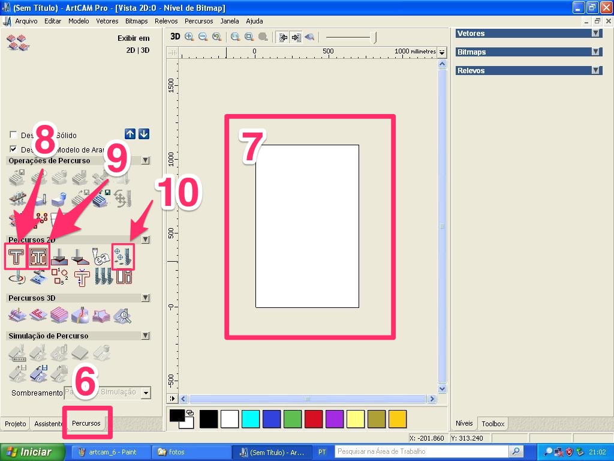

8. Para **perfilar** (isto é, cortar), seleciona a opção em destaque.
	* 8.1. Indique se o corte deve ser executado por fora ou por dentro.
	* 8.2. Defina a profundidade inicial — normalmente será igual a 0.
	* 8.3. Defina a profundidade final — normalmente será a espessura do material (exemplo: “18” para uma chapa de 18mm de espessura).
	* 8.4. Selecione o tipo de ferramenta (mais informação em seguida).
	* 8.5. Escolha um nome para o percursos (opcional, auxilia no momento de exportar para G-code).
	* 8.6. Gere o percurso clicando em “Agora”.
	* 8.7. Feche o menu de perfilagem.

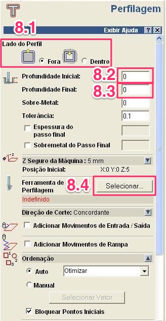

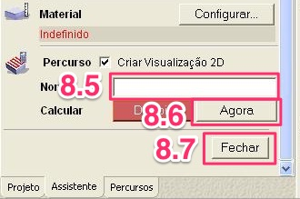

> **ESCOLHENDO FERRAMENTAS**:
> 	* A.1. Selecione a ferramenta desejada na lista, que normalmente irá contemplar todas as ferramentas que temos disponíveis em nossa máquina.
>	* A.2. Veja informações relevantes na área em destaque.
>	* A.3. Adicione novas ferramentas clicando em "+ Ferramenta".
>	* A.4. Finalize a operação clicando em "Selecionar".

9. Para **desbastar** (isto é, remover material), seleciona a opção em destaque.
	* 9.1. Defina a profundidade inicial — normalmente será igual a 0.
	* 9.2. Defina a profundidade final.
	* 9.3. Selecione o tipo de ferramenta.
	* 9.4. Escolha um nome para o percursos (opcional, auxilia no momento de exportar para G-code).
	* 9.5. Gere o percurso clicando em “Agora”.
	* 9.6. Feche o menu de desbaste.

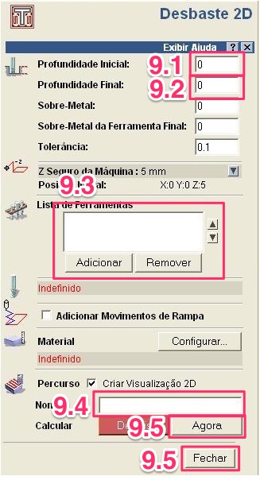

10. Para **perfurar**, seleciona a opção em destaque.
	* 10.1. Defina a profundidade inicial — normalmente será igual a 0.
	* 10.2. Defina a profundidade final.
	* 10.3. Selecione o tipo de ferramenta.
	* 10.4. Escolha um nome para o percursos (opcional, auxilia no momento de exportar para G-code).
	* 10.5. Gere o percurso clicando em “Agora”.
	* 10.6. Feche o menu de desbaste.

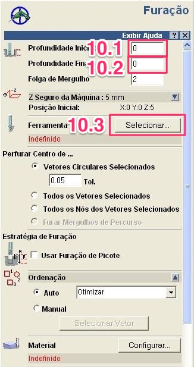

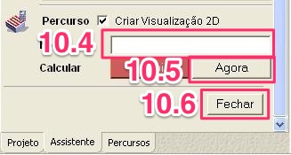

11. Ao finalizar a criação dos percursos, acesse o menu "Percursos" e selecione a opção "Salvar Percurso Como...".
	* 11.1. Na tela "Salvar Percursos" você pode ver, à esquerda, os percursos criados.
	* 11.2. Selecione os percursos que você desejar exportar e utilize os botões de setas para esquerda e direita para adicionar ou remover os percursos a serem exportados.
	* 11.3. Na área à direita você encontra os percursos que serão exportados.
		* **IMPORTANTE**: selecione bem a ordem dos percursos a serem exportados. Percursos de perfuração e desbaste normalmente devem vir primeiro, seguidos de perfilagem interna e, por último, perfilagem externa. É importante notar que a perfilagem externa deve ser a última pois a peça poderá se soltar após sua conclusão, dificultando as demais operações que poderiam ser executadas naquela peça.
	* 11.4. Utilize as setas para cima e baixo para alterar a ordem de exportação dos percursos.
	* 11.5. Certifique-se de exportar o arquivo como ".tap".
	* 11.6. Termina a exportação clicando em "Salvar...".

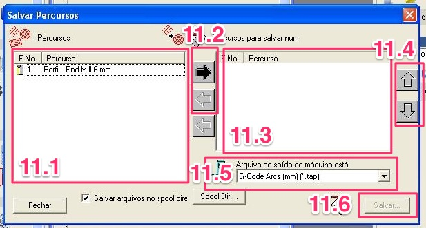

## Normas de segurança

* Use óculos de proteção quando estiver operando a máquina.
* Não toque ou manipule as peças enquanto a máquina estiver operando.
* Nunca deixe ferramentas ou quaisquer outros objetos em cima da mesa ou da chapa sendo usinada.
* Certifique-se que o spinner e a fresa não se encontram perto de nenhum material ao ligar a máquina.

## Dicas de uso e manutenção da máquina

### Antes de iniciar os trabalhos

* Antes de ligar a máquina, verifique se o cabo da porta paralela e o cabo USB dos controladores estão conectados corretamente no computador e se os cabos de energia estão ligados no estabilizador.
* Sempre ligue o computador antes de ligar a máquina, caso contrário o spinner pode ligar automaticamente.
* Após ligar a máquina, verifique se o cano que bombeia água para o spinner está dentro do reservatório e se a bomba está funcionando — isto é, a água está fluindo.

### Durante os trabalhos

* Se a fresa estiver fazendo muito barulho e aparentar que está “trabalhando muito” para conseguir cortar o material, tente aumentar a rotação do spinner.
* Se você perceber que a fresa está queimando o material, diminua a rotação do spinner ou verifique a quantidade de hélices da fresa (menos hélices = menor frequência de corte e menor chance de queimar).
* Se a máquina apresentar algum barulho “estranho”, busque ajuda.
* **IMPORTANTE:** Se você pausar o programa, lembre-se de ligar o spinner manualmente antes de reiniciá-lo.
	* Como a instrução de ligar spindle (M03/M04) normalmente aparece apenas no início do programa, pausá-lo e depois continuar da linha que parou não irá garantir que a instrução seja executada novamente. Se não ligarmos o spindle manualmente, a fresa irá avançar sem rotacionar e, consequentemente, quebrar ao atingir o material.
* **IMPORTANTE:** Use o botão vermelho para parar imediatamente o trabalho em casos de emergência.

### Ao terminar os trabalhos

* Certifique-se de sempre desligar a máquina, o computador e o estabilizador (nesta ordem).
* Remova da mesa a chapa utilizada e quaisquer outros materiais — como parafusos utilizados para prender a chapa.
* Limpe a máquina, incluindo as guias e spinner.
* Mantenha a máquina lubrificada, passando o óleo de motor com ajuda de um pincel.
* Troque a placa de sacrifício se ela estiver muito gasta.
* Esvazie o reservatório do ciclone/aspirador.

### Periodicamente

* Troque a água/fluído de refrigeração.

## Configuração e controle da máquina

Com o G-code em mãos, gerado a partir da criação dos percursos no CAM, estamos prontos para usinar as peças. Para isso, revise as [normas de segurança](#normas-de-segurança) e [as dicas de uso da máquina](#antes-de-iniciar-os-trabalhos).

> **NA FRESADORA:** certifique-se que a fresa correta esteja devidamente instalada. Caso precise instalar, remova a anterior com auxílio de duas chaves de boca, utilize a pinça adequada encaixando a fresa correta (como indicado no primeiro GIF), e instale a fresa novamente no spindle com as chaves de boca (como indicado no segundo GIF) — **importante:** não é necessário apertar muito! Mantenha as lâminas da fresa para fora da pinça, deixando parte do corpo (ou todo o corpo) dentro.

Ligue o computador e depois a máquina — lembre-se: essa ordem é importante. Coloque a chapa de material na mesa, prestando atenção para fixá-la bem (dica: parafuse as extremidades das chapas ou use sargentos).

### Configuração do projeto no Mach3

1. Para começar, abra o Mach3 e certifique-se que o botão “Reset” não esteja piscando. Se estiver, significa que a máquina está em /stand-by/. Clique para ativá-la. O botão deve ficar apenas com a borda verde, sem piscar.
	* 1.1. Caso a máquina ainda não resposta, clique duas vezes para reiniciá-la.

> **NA FRESADORA:** com o auxílio de um papel ou plástico, abaixe lentamente a fresa até ela fazer com que o papel ou plástico pare de se mexer, como indicado no GIF abaixo. Utilize as teclas “Page Down” e “Page Up” do teclado para, respectivamente, abaixar e levantar o spindle e as setas para mexer o spindle horizontalmente nos eixos X e Y.

2. Pressione os botões “Zero X”, “Zero Y” e “Zero Z” para zerar os três eixos.
3. As referências devem ficar todas zeradas.

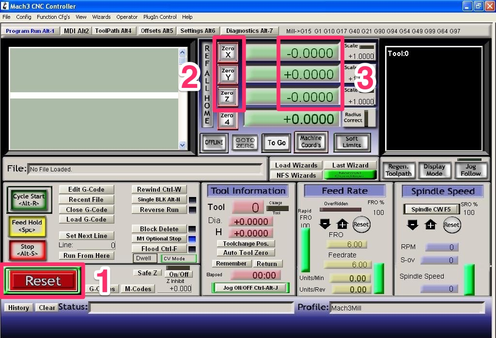

4. Clique em “Load G-Code” e selecione o arquivo “.tap” do seu projeto.
5. O código carregado irá aparecer na área em destaque.
6. Clique em “Regen. Toolpath” para atualizar os caminhos que a ferramenta irá fazer.
7. Os caminhos da ferramenta irão aparecer na área em destaque. Note que você poderá acompanhar o progresso da usinagem e execução do G-code por aqui.
8. Clique em “Cycle Start” para iniciar o processo de usinagem.

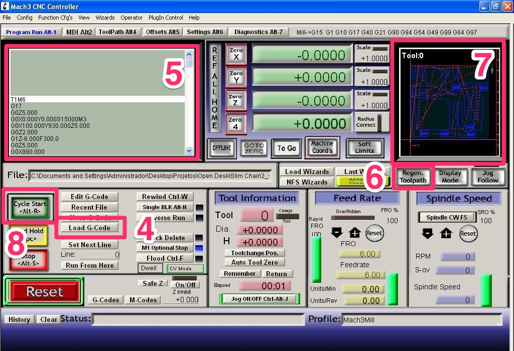

### Funcionalidades úteis do Mach3

* A. Para **iniciar/pausar spindle manualmente**, clique em “Spindle CW”
	* **IMPORTANTE**: certifique-se se a fresa está na posição desejada antes de ligar o spindle manualmente.
* B. Para **pausar temporariamente a usinagem**, clique em “Feed Hold”.
* C. Para **parar completamente a usinagem**, clique em “Stop”.
* D. Para **movimentar a fresa à posição original (zero)**, clique em “GOTO ZERO”.
* E. Para **configurar o feedrate (velocidade de passo horizontal)**, utilize o campo “Feedrate”.
	* Esse valor normalmente é inicializado automaticamente ao carregar seu programa. Caso isso não aconteça, utilize o campo para preencher com o valor desejado — normalmente 3.000.
* F. Para **sobrescrever o feedrate**, utilize o campo “FRO”.
	* Esse valor é utilizado para definir um valor de feedrate temporário. Isso é útil quando quisermos fazer com que a ferramenta se mova mais rápida ou devagar em determinadas operações.
	* É comum deixar esse valor em 60%~70% para operações mais pesadas como perfilagem e desbaste. Furações podem ser feitas em 100%. Obviamente, esses valores podem variar de acordo com material, ferramenta e feedrate inicial.

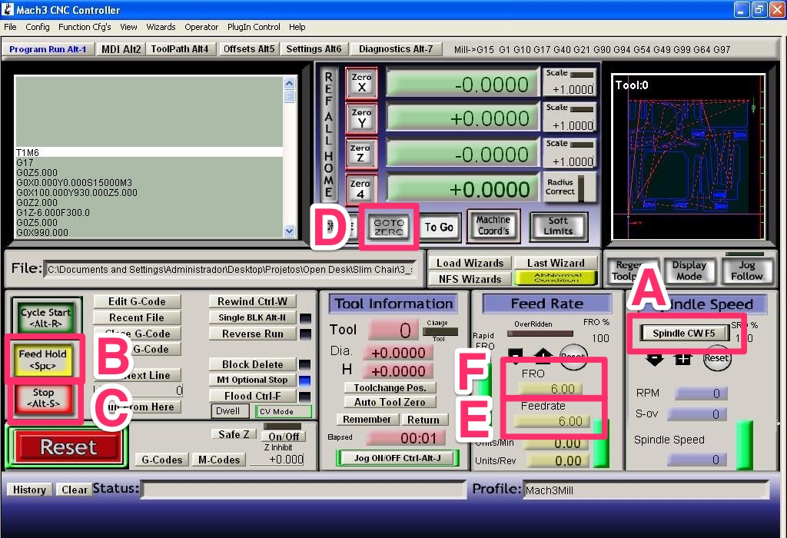

* G. Para **executar um ponto específico do G-code**:
	* G.1. Seleciona a linha desejada. Lembre-se que essa linha **será a primeira a ser executada**.
	* G.2. Opcionalmente, insira a linha no campo “Line”. Clique em “Set Next Line” para definir a linha em questão como próxima a ser executada.
	* G.3. Ao clicar em “Cycle Start”, o programa irá iniciar a partir da linha indicada.

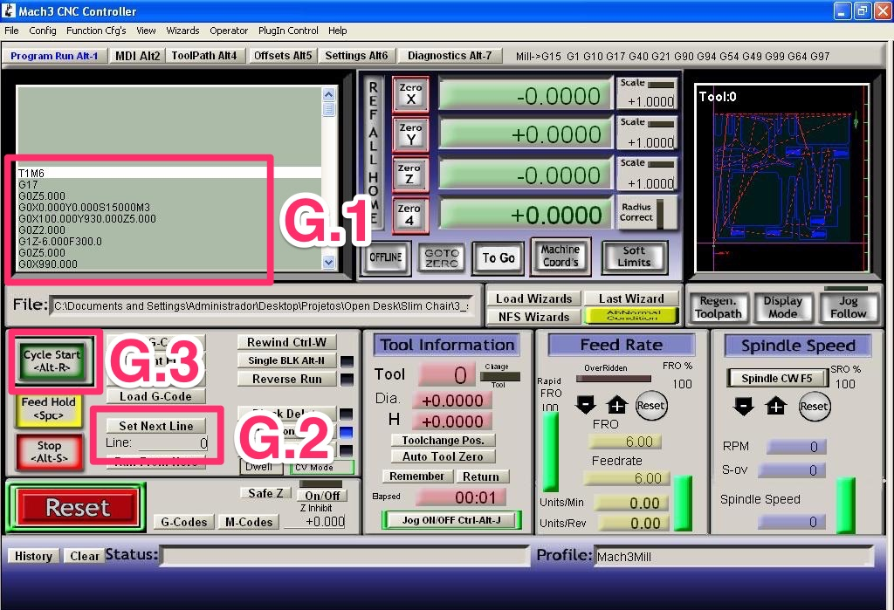

* H. Para **temporariamente diminuir a velocidade de movimentação manual do spindle** , pressione “Tab” no teclado e use o campo “Slow Jog Rate” para configurar a velocidade.
	* Essa configuração é útil quando estamos mexendo o spindle e precisamos de maior precisão.
	* Tente colocar um valor em torno de 10%~20% para ajudar na movimentação precisa do spindle. Se quiser temporariamente desativar essa opção, pressione “Shift” no teclado ao movimentar o spindle — isso fará com que o spindle se mova com velocidade máxima.

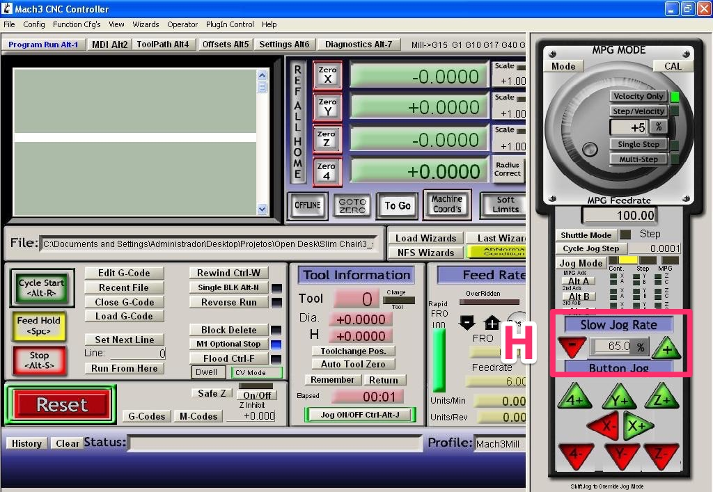

* I. Para **executar comandos em G-code manualmente**:
	* I.1. Acesse a aba “MDI”.
	* I.2. Utilize o campo “Input” para executar os comandos.
		* Por padrão, os comandos são executados em modo absoluto. Ou seja, ao digitar um valor como “X10.0”, o spindle será movimentado **até a posição “10.0” em “X”** e não necessariamente **irá avançar “10.0” na direção “X”** (comportamento obtido em modo relativo).

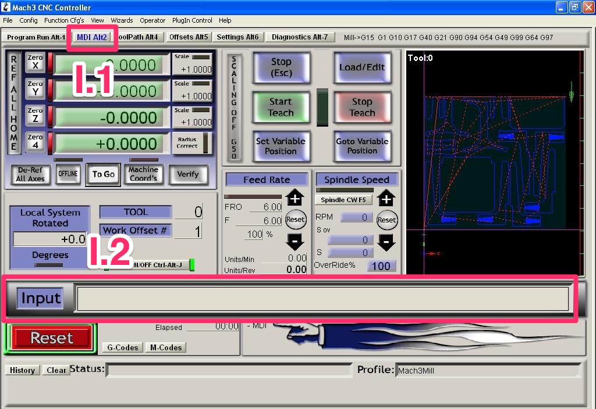

## Controlando a rotação

Parar controlar a rotação do spindle, utilize o controlador do painel de controle.

Com exceção de fresas muito pequenas (como 1.5mm), usar uma rotação menor que a ideal é preferível do que usar uma rotação acima da ideal. Existem vários fatores que influenciam a rotação ideal, como a dureza do material e o tipo de fresa sendo utilizada. Consulte a tabela abaixo para verificar as rotações mais indicadas em cada situação ([fonte](http://store.curiousinventor.com/guides/drill_speed)).

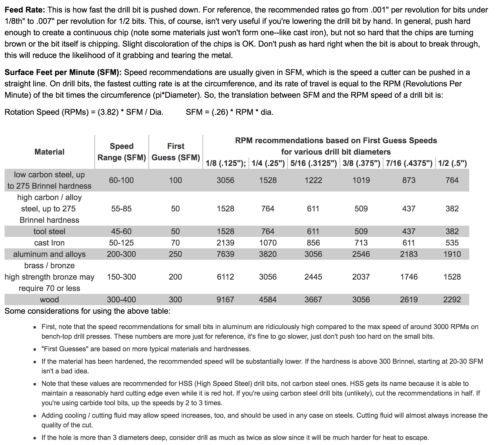

## Referências

* [Lista de códigos G-code](https://en.wikipedia.org/wiki/G-code)
* [Tutorial sobre G-code](https://all3dp.com/g-code-tutorial-3d-printer-gcode-commands/)
